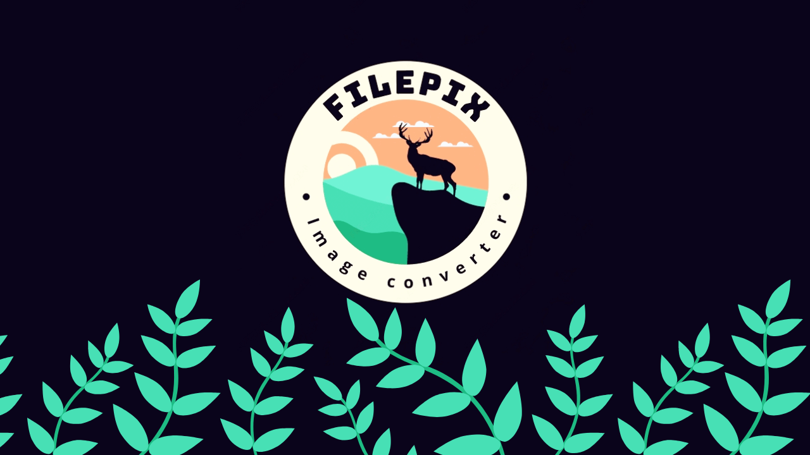

# FilePix
[](https://www.npmjs.com/package/filepix)

<center> </center>

<p class="lead">powerful image converter package, it can convert images into a different formats, it includes below features:</p>

* [convert pdf to word document](#convert-pdf-to-word-document)
* [convert images into a single pdf file](#convert-images-to-pdf)
* [convert pdf to multiple image file](#convert-pdf-to-images)
* [convert png to jpg](#convert-png-to-jpg)
* [convert base64 to jpg or png](#base64-to-jpg-or-png)
* [compress image files](#convert-png-to-jpg)
* [add watermarks or extra effects to your image files](#add-effects)

<hr>

## Installation
Install via NPM:

```bash
npm install filepix
```
<p class="lead">Then you can <strong>require</strong> or <strong>import</strong> as usual:</p>

```javascript
const filepix = require("filepix");
```
```typescript
import * as filepix from "filepix";
```
<hr>

## Convert images to PDF

this feature let you convert your images into a single pdf file
<h3>Basic Usage</h3>
<p class="lead mb-5">if you want to convert all images inside a specific directory you can use below code:
</p>
<p class="lead mb-10"><code>pages</code>: images directory path</br>
  <code>source</code>: output for saving final PDF file
</p>


```javascript
filepix.img2PDF(pages = './inputImagesDir', output = "./outputImageDir/output.pdf");
```
or maybe your images file in different path for this case you can use below code:

```javascript
filepix.img2PDF(
  pages = [
        './1.jpg',
        './public/upload/2.jpg',
        './public/upload/example/3.jpg'
  ],
  output = "./outputImageDir/output.pdf");
```

### Add effects

<p class="lead mb-5">add easily a lot of effect to your images while converting to pdf
</p>
add effect to your final pdf by set some options.

#### Color
Apply multiple color modification rules

```javascript
let options = {
   effects: [
              {
                  name: 'color',
                  config: [{ apply: 'green', params: [100] }]
              }
            ]
  };
filepix.img2PDF(pages = './inputImagesDir', output = "./outputImageDir/output.pdf", options);
```

#### Flip
Flip the image horizontally or vertically. Defaults to horizontal.
```javascript
let options = {
   effects: [
              {
                  name: 'mirror'
              }
            ]
  };

```
```javascript
let options = {
   effects: [
              {
                name: 'flip',
                config: {
                    vertical: true
                }
              }
            ]
  };
filepix.img2PDF(pages = './inputImagesDir', output = "./outputImageDir/output.pdf", options);
```
#### Blur
A fast blur algorithm that produces similar effect to a Gaussian blur
```javascript
let options = {
   effects: [
              {
                name: 'blur',
                config: {
                    pixels: 50
                }
              }
            ]
  };
```
#### Rotate
Rotates the image clockwise by a number of degrees. By default the width and height of the image will be resized appropriately.
```javascript
let options = {
   effects: [
              {
                name: 'rotate',
                config: {
                    ratio: 45
                }
              }
            ]
};
```
#### Brightness
```javascript
let options = {
   effects: [
              {
                name: 'brightness',
                config: {
                    ratio: 0.1
                }
              }
            ]
};
```
#### Contrast
```javascript
let options = {
   effects: [
              {
                name: 'contrast',
                config: {
                    ratio: 0.2
                }
              }
            ]
  };
```
#### Gaussian

```javascript
let options = {
   effects: [
              {
                name: 'gaussian',
                config: {
                    ratio: 2
                }
              }
            ]
};
```

#### Posterize
```javascript
let options = {
   effects: [
              {
                name: 'posterize',
                config: {
                    ratio: 100
                }
              }
            ]
};
```
#### Opacity
```javascript
let options = {
   effects: [
              {
                name: 'opacity',
                config: {
                    ratio: 0.1
                }
              }
            ]
};
```
### Sepia
```javascript
let options = {
   effects: [
              {
                name: 'sepia'
              }
            ]
};
```

#### Quality
```javascript
let options = {
   effects: [
              {
                name: 'quality',
                config: {
                    ratio: 10
                }
              }
            ]
};
```
#### Fade
```javascript
let options = {
   effects: [
              {
                name: 'fade',
                config: {
                    ratio: 0.1
                }
              }
            ]
};
```
#### Pixelate
```javascript
let options = {
   effects: [
              {
                name: 'pixelate',
                config: {
                    ratio: 50
                }
              }
            ]
};
```
#### Normalize
```javascript
let options = {
   effects: [
              {
                name: 'normalize',
                config: {
                    ratio: 50
                }
              }
            ]
};
```
#### Threshold
```javascript
let options = {
   effects: [
              {
                name: 'threshold',
                config: { max: 200, replace: 200, autoGreyscale: false }
              }
            ]
};
```
#### multiple effects
you can combine effects by using below code:
```javascript
let options = {
   effects: [
            {
                name: 'quality',
                config: {
                    ratio: 10
                }
            },
            {
                name: 'contrast',
                config: {
                    ratio: 0.2
                }
            },
            {
              name: 'threshold',
              config: { max: 200 }
            }
          ]
};
```
### Add watermarks
you can add watermark to all images and merge them as single pdf by set below option
path: watermark image path
position: watermark position (center,right,right-bottom,center-bottom,left-top,left-bottom)

```javascript
options = {
  watermark: {
            type: 'image',
            path: '../logo1.jpg',
            ratio: 0.2,
            opacity: 0.2,
            position: 'left-bottom'
  }
}
```
<hr>

## Convert pdf to images

this feature let you convert your pdf into multiple images.
<h3>Basic Usage</h3>

```javascript
filepix.PDF2img('./inputImagesDir/input.pdf', "./outputImageDir");
```
<hr>

## Convert pdf to word document


> **_NOTE:_**  this method using OCR so first, you need to install the Tesseract project. Instructions for installing Tesseract for all platforms can be found on [the project site](https://github.com/tesseract-ocr/tessdoc/blob/master/Installation.md).

after installing Tesseract you can easily convert your pdf into file as docx format by calling below code:
```javascript
await filepix.pdf2docx('./inputImageDir/input.pdf', './outputImageDir/output.docx');
```

#### Custom Language

1- find your LangCode from <a href="https://tesseract-ocr.github.io/tessdoc/Data-Files-in-different-versions.html" target="_blank">here</a></br>
2- download proper .traineddata file from <a href="https://github.com/tesseract-ocr/tessdata" target="_blank">here</a> and copy it on your local machine in Tesseract-OCR/tessdata  directory</br>
3- finally use below code:</br>

```javascript
await filepix.pdf2docx('./inputImageDir/input.pdf', './outputImageDir/output.docx',  options = { lang: "deu" });
```
<hr>

## Convert png to jpg

convert png format into jpg even you can compress your image.

```javascript
await filepix.png2jpeg('./input.png', './output.jpg'
, options = {
  quality: 50
});
```
<hr>

## base64 to jpg or png

convert base64 to png or jpg by calling below method.

```javascript
await filepix.base64ToImg('base64Str', './outputImageDir/output.png', { extension: 'png' });
```
<hr>

## Support
  - [Bug Reports](https://github.com/hamedpa/filepix/issues/)

## Contributors
<p>
Pull requests are always welcome! Please base pull requests against the main branch and follow the contributing guide.

if your pull requests makes documentation changes, please update readme file.
</p>

## License

This project is licensed under the terms of the
MIT license
